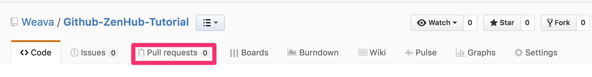
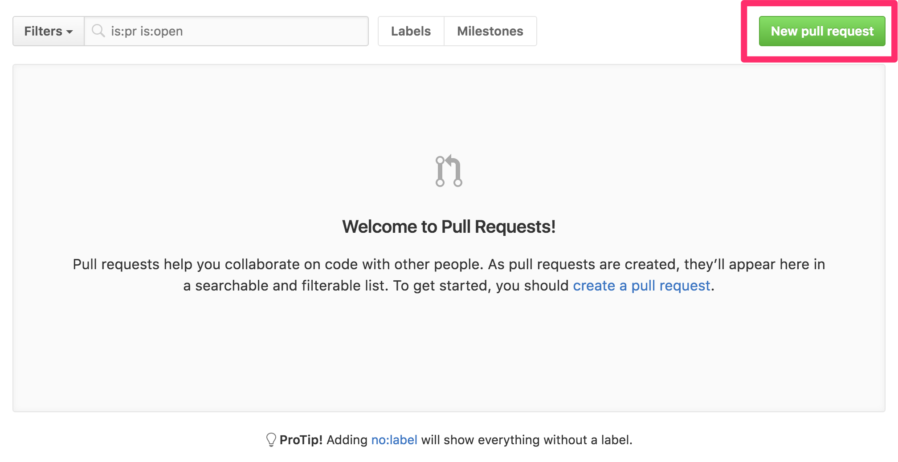
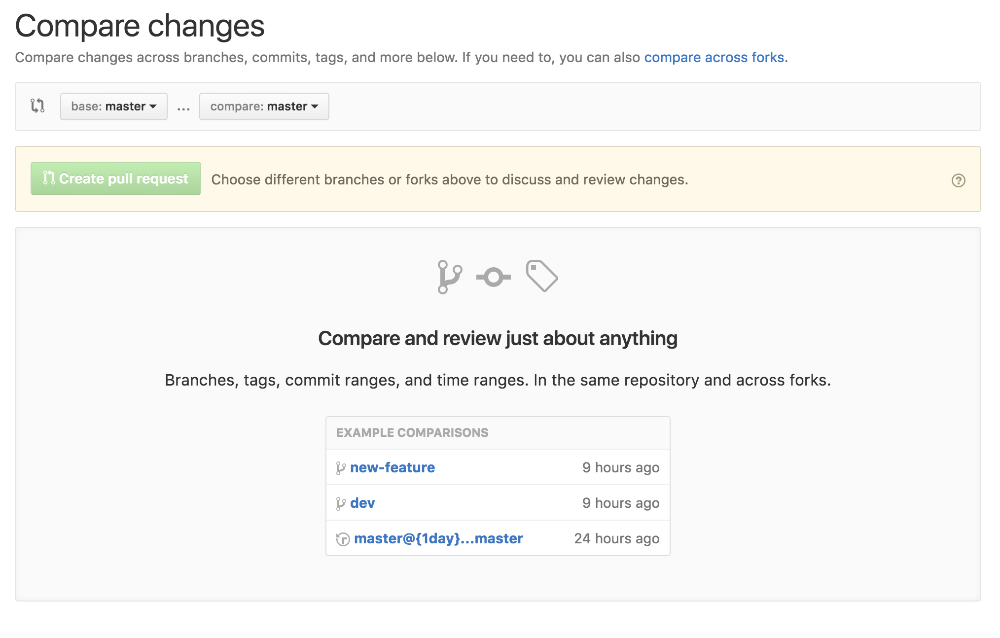

# Github-ZenHub-Tutorial Dev Branch

This is the `dev` branch.

This is where a working set of the application is actively being developed on and tested. It is here that many will checkout new feature branches for developing new application requirements.

In the future, this you will more than likely need to make a pull request into this branch.

I personally like using the Github visual tool. This can be found up at the top tab bar within every repository you will ever create.

From this screen you will then see a list of current pull requests, as well as a button to create a new pull request.

Click that create pull request button, and you will be sent to a screen that will allow you to choose what branch you want to merge with.

Once selected, you will be given an overview of what has changed, and whether or not there might be merge conflicts. If everything is good, you will be able to submit your pull request.

Upon submission, the team leads should be notified, and should sit down with you to review your commits, what changes were made, what they will affect, and the quality of the code that could potentially go into production.
